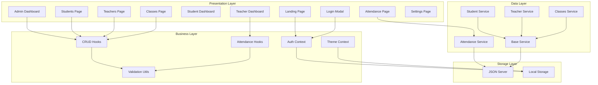
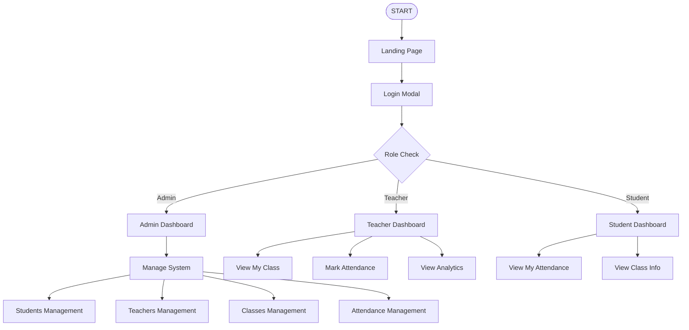
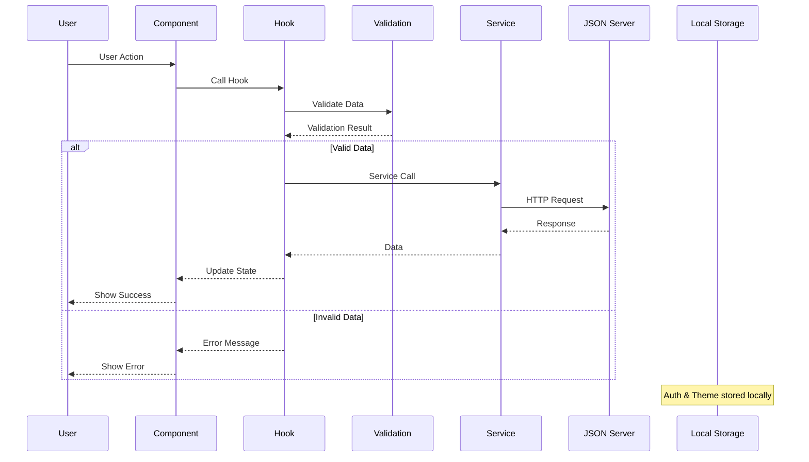
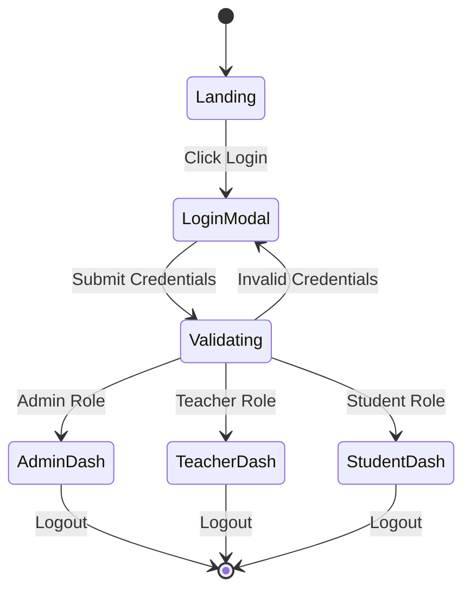
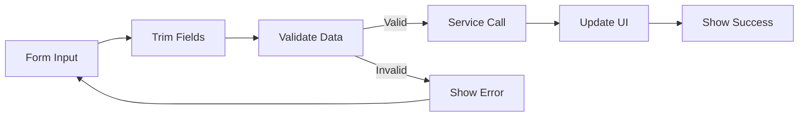
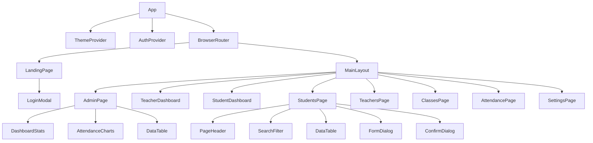
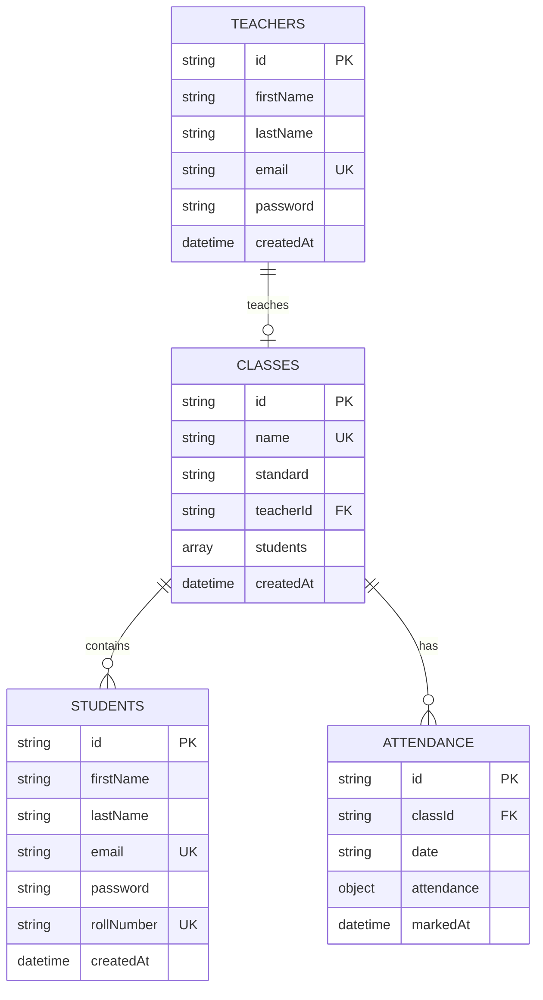
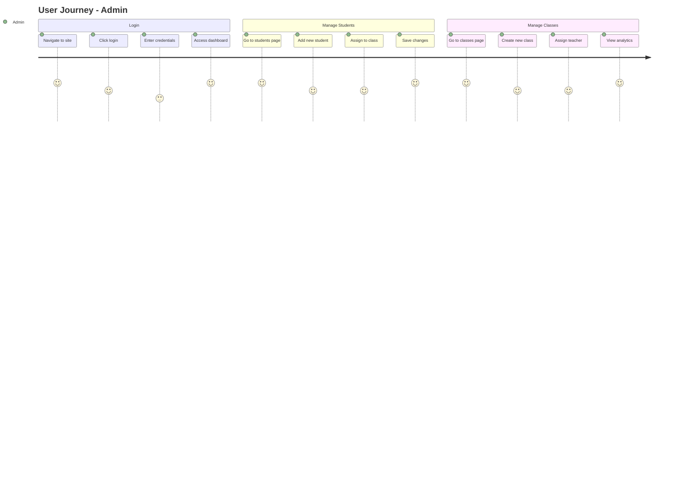
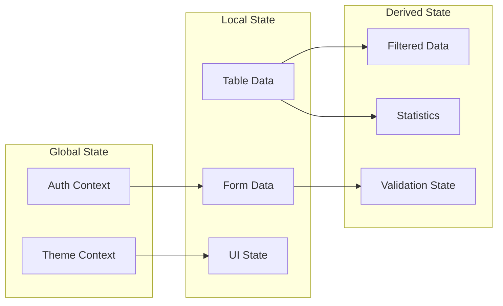

# Attendo - Mermaid Charts

## System Architecture

## Application Flow

## Data Flow

## Authentication Flow

## CRUD Operations Flow

## Component Hierarchy

## Database Schema

## User Journey Map

## State Management

